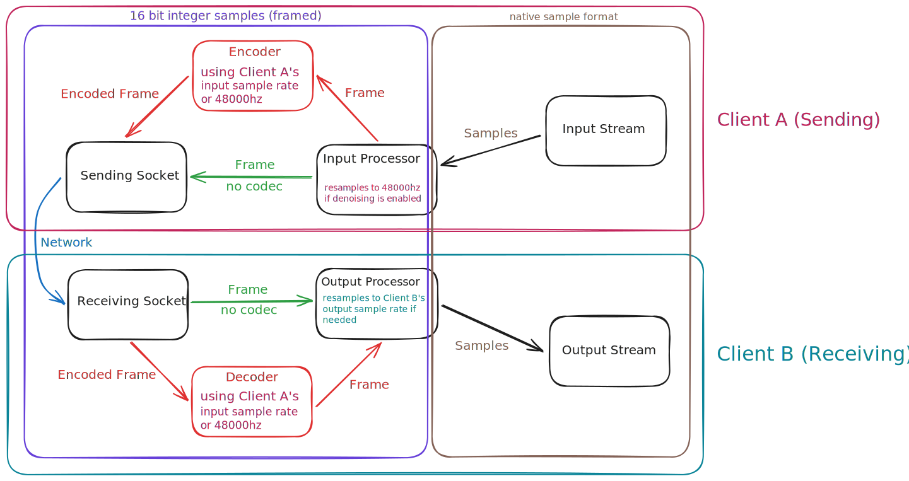

## Features

- [Flutter](https://flutter.dev/) UI with Windows, Linux, macOS, iOS, and Android support
- [libp2p](https://libp2p.io/) networking and cryptography, enables p2p networking without port forwarding
- Lossless raw audio and [SEA codec](https://github.com/Daninet/sea-codec) options
- [nnnoiseless](https://github.com/jneem/nnnoiseless) noise suppression
- Built-in text chat with attachments
- Efficient use of CPU and memory resources
- Low end-to-end latency

## Work in Progress

- Screensharing for Windows, macOS, and Linux
- Game overlay for Windows
- Web support (waiting on https://github.com/libp2p/rust-libp2p/pull/5564)

## Planned

- Lossless audio codec support
- Telepathy rooms (group calls)

## History

- Began as Audio Chat, a Python Tkinter app with simple UDP networking and AES cryptography
- Moved to the current Rust audio processing stack with improved stability
- Upgraded from custom networking and cryptography stack to libp2p for improved security, p2p networking without port forwarding, and p2p networking in web browsers

## UI Screenshots

## Architecture

### Audio Processing Stack
- Denoising runs on the sending side, each participant in a call decides if they want to use their compute resources to denoise their audio input
- Every participant in a call must agree on the same audio codec options for sending & receiving
- If a frame's RMS is below the input sensitivity threshold, it becomes a single byte silent frame to save resources
- In a classic two-way call, each client runs a sending stack and a receiving stack
- In a Telepathy room, certain parts of each stack are duplicated to support more participants
