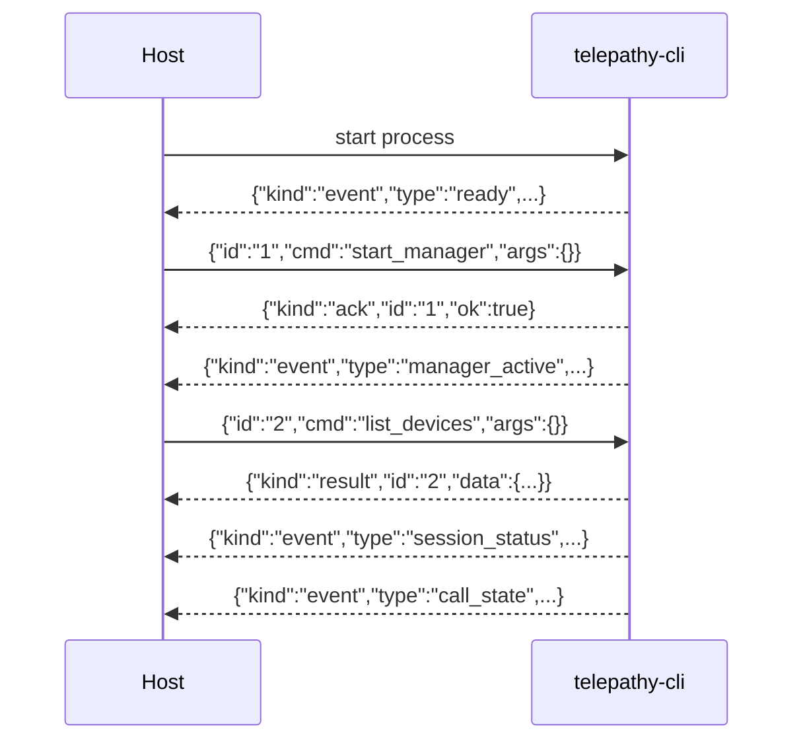

# Telepathy CLI Protocol

This document is the complete wire-protocol reference for `telepathy-cli`.
It covers startup configuration, input commands, and output lines (`ack`, `result`, `event`).

`telepathy-cli` reads newline-delimited JSON from `stdin` and writes newline-delimited JSON to `stdout`.
Each line is a complete JSON object.

## Startup

Startup relay configuration can be provided in two ways:

- CLI flags: `--relay <socket-addr>` and `--relay-peer <peer-id>`
- Environment variables: `TELEPATHY_RELAY_ADDR` and `TELEPATHY_RELAY_PEER`

`--relay` / `TELEPATHY_RELAY_ADDR` must be a socket address string accepted by Rust `SocketAddr` parsing (for example: `203.0.113.10:4001` or `[2001:db8::1]:4001`).

Precedence:

- If both flags and env vars are provided, flags win.

Startup failure behavior:

- On startup failure, the process writes a single `error` event to `stdout` and exits.

## Input Format

Input is an envelope with a flattened command:

```json
{"id":"<string>","cmd":"<snake_case_variant>","args":{...}}
```

For unit variants, `args` may be `{}` or may be omitted.

### Commands

| `cmd` | `args` fields |
|---|---|
| `set_identity` | `key_b64: string` (standard base64 of the raw key bytes) |
| `add_contact` | `id: string`, `nickname: string`, `peer_id: string` |
| `remove_contact` | `id: string` |
| `start_manager` | _(none)_ |
| `restart_manager` | _(none)_ |
| `shutdown` | _(none)_ |
| `start_session` | `contact_id: string` |
| `stop_session` | `contact_id: string` |
| `start_call` | `contact_id: string` |
| `end_call` | _(none)_ |
| `accept_call` | `request_id: string`, `accept: bool` |
| `join_room` | `members: [string]` (array of peer ID strings) |
| `send_chat` | `contact_id: string`, `text: string`, `attachments: [{name: string, data_b64: string}]` |
| `audio_test` | _(none)_ |
| `set_muted` | `value: bool` |
| `set_deafened` | `value: bool` |
| `set_input_volume_db` | `value: f32` |
| `set_output_volume_db` | `value: f32` |
| `set_rms_threshold_db` | `value: f32` |
| `set_denoise` | `value: bool` |
| `set_efficiency_mode` | `value: bool` |
| `set_play_custom_ringtones` | `value: bool` |
| `set_input_device` | `id: string \| null` |
| `set_output_device` | `id: string \| null` |
| `list_devices` | _(none)_ |

## Output Format

Output lines are tagged objects:

- `{"kind":"ack", ...}`
- `{"kind":"result", ...}`
- `{"kind":"event", ...}`

### Ack / Result

Acknowledgements and results:

```json
{"kind":"ack","id":"<string>","ok":true}
{"kind":"ack","id":"<string>","ok":false,"error":"<string>"}
{"kind":"result","id":"<string>","data":{...}}
```

Notes:

- `error` is omitted on successful `ack` lines.
- `id` is the request id from the input envelope.
- Most commands emit an `ack` line.
- `list_devices` currently emits only a `result` line (no `ack`).

Currently, the only command that returns `kind:"result"` is `list_devices`:

```json
{"kind":"result","id":"<string>","data":{"supported":false,"reason":"<string>"}}
```

### Events

Event lines flatten event payload fields into the top-level object:

```json
{"kind":"event","type":"<snake_case>", ...fields}
```

#### `ready`

Emitted once at startup:

```json
{"kind":"event","type":"ready","version":"<semver string>"}
```

#### `manager_active`

Emitted when the network manager starts or stops:

```json
{"kind":"event","type":"manager_active","active":true,"restartable":false}
```

#### `session_status`

Emitted when a peer's connection state changes.
`peer` is the contact's peer ID string.
`status` values:

```json
{"kind":"event","type":"session_status","peer":"<peer-id>","status":"Connecting"}
{"kind":"event","type":"session_status","peer":"<peer-id>","status":"Inactive"}
{"kind":"event","type":"session_status","peer":"<peer-id>","status":"Unknown"}
{"kind":"event","type":"session_status","peer":"<peer-id>","status":{"Connected":{"relayed":true,"remote_address":"1.2.3.4:5000"}}}
```

#### `call_state`

Emitted when call state changes.
`state` values:

```json
{"kind":"event","type":"call_state","state":"Connected"}
{"kind":"event","type":"call_state","state":"Waiting"}
{"kind":"event","type":"call_state","state":{"RoomJoin":"<peer-id>"}}
{"kind":"event","type":"call_state","state":{"RoomLeave":"<peer-id>"}}
{"kind":"event","type":"call_state","state":{"CallEnded":["<reason-string>",<was_error:bool>]}}
```

#### `statistics`

Emitted periodically during a call.
Fields are flat (not nested):

```json
{"kind":"event","type":"statistics","input_level":0.0,"output_level":0.0,"latency":0,"upload_bandwidth":0,"download_bandwidth":0,"loss":0}
```

#### `message_received`

Emitted when a chat message arrives.
`receiver` is a peer ID string.
`time` is an RFC 3339 UTC timestamp with millisecond precision.
`attachments` entries include `name` and raw byte array `data` (not base64):

```json
{"kind":"event","type":"message_received","text":"hello","receiver":"<peer-id>","time":"2025-05-07T12:00:00.000Z","attachments":[{"name":"file.txt","data":[104,101,108,108,111]}]}
```

#### `screenshare_started`

Emitted when a screenshare session begins.
`sender: true` means this peer is the one sharing:

```json
{"kind":"event","type":"screenshare_started","sender":true}
```

#### `accept_call_prompt`

Emitted when an incoming call arrives and user confirmation is required.
Respond with `accept_call` and the provided `request_id`:

```json
{"kind":"event","type":"accept_call_prompt","request_id":"<uuid>","contact_id":"<string>","has_ringtone":false}
```

#### `accept_call_canceled`

Emitted if the caller hangs up before the prompt is answered:

```json
{"kind":"event","type":"accept_call_canceled","request_id":"<uuid>"}
```

#### `error`

Emitted for parse errors, stdin errors, and startup failures.
`id` is `null` for protocol-level errors:

```json
{"kind":"event","type":"error","id":null,"message":"<string>"}
```

## Lifecycle

Expected high-level interaction:

1. Host starts `telepathy-cli`.
2. CLI initializes and emits `ready`.
3. Host sends commands with unique `id` values.
4. CLI emits an `ack` for most requests; `list_devices` emits only `result`.
5. CLI emits asynchronous `event` lines at any time.
6. On fatal startup failure, CLI emits one `error` event and exits.



## Attachments Encoding Asymmetry

Attachments use different encodings for input and output:

- In `send_chat` input, attachment bytes are provided as base64 string `data_b64`.
- In `message_received` output, attachment bytes are serialized as raw JSON byte array `data` (`[u8]`).

Consumers should implement both paths explicitly:

- Encode bytes to base64 for `send_chat`.
- Decode raw numeric arrays for `message_received`.
