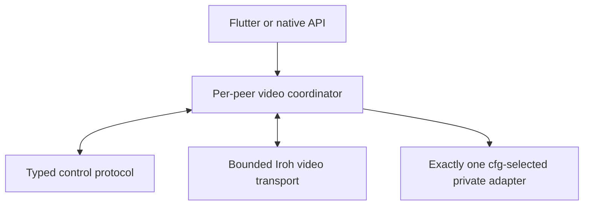
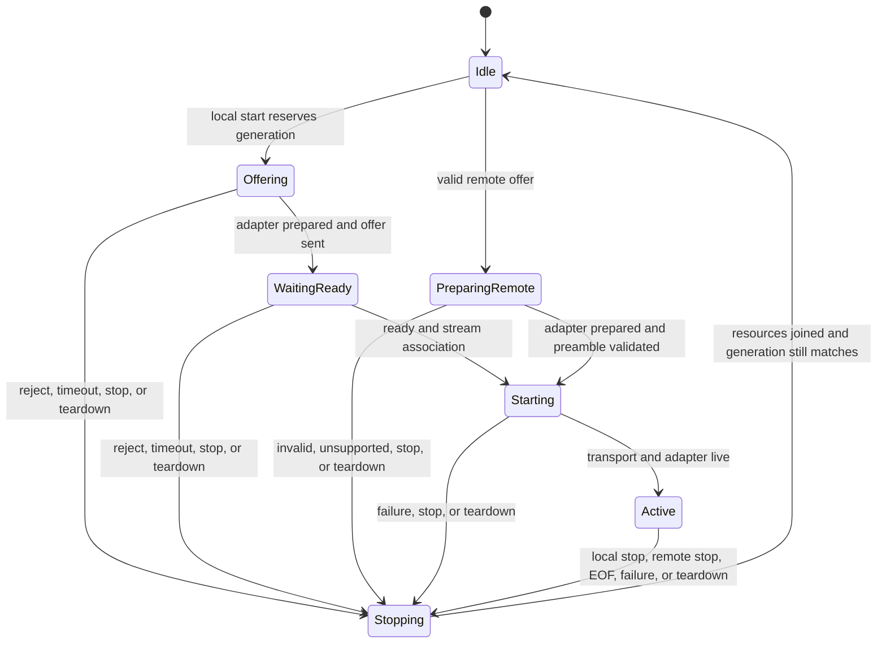
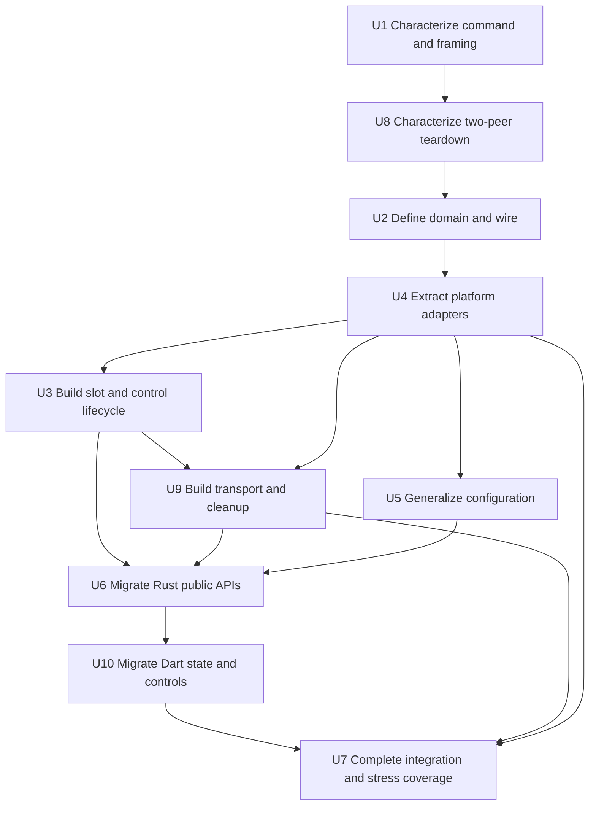
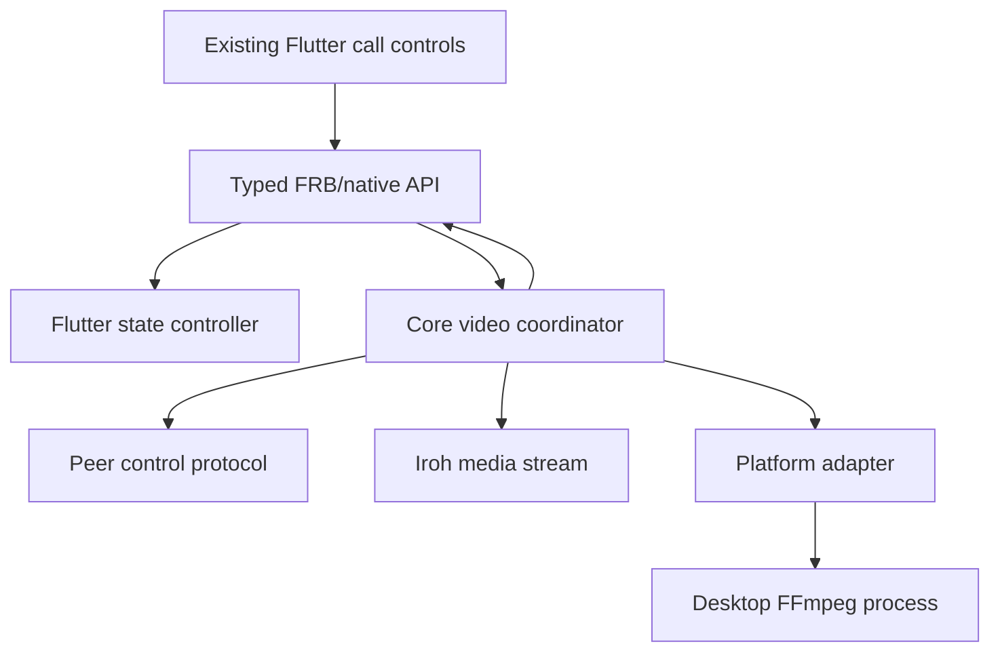

# refactor: Introduce generic video sessions

## Summary

Replace screenshare-specific lifecycle, signaling, transport, and bridge contracts with one typed video-session architecture. Preserve current desktop FFmpeg capture/playback behavior as the first statically selected platform adapter, while making future source and platform additions local to domain/configuration and adapter boundaries.

---

## Problem Frame

Screensharing currently spans peer session state, control messages, Iroh stream setup, FFmpeg process management, persisted settings, and Flutter callbacks, but those layers all use screenshare-specific vocabulary and ownership. Adding another video source or a mobile/web implementation would require another cross-cutting path rather than one bounded extension.

The current flow also has no direct screenshare tests and represents ownership with replaceable `Notify` handles. Starts, failures, remote stops, call teardown, and stale task completion are therefore not expressed as one lifecycle and can leave UI state or child-process cleanup dependent on incidental ordering.

---

## Requirements

- R1. Existing Windows, macOS, and Linux screensharing must continue using FFmpeg/ffplay with the same supported devices, encoders, command behavior, framed byte path, settings, and user interaction.
- R2. Core lifecycle, signaling, transport framing, session identity, roles, phases, and terminal reasons must use generic video-session vocabulary rather than screenshare or FFmpeg concepts.
- R3. A single per-peer coordinator must own video-session state and Iroh stream orchestration; platform adapters must not own signaling or transport negotiation.
- R4. Platform implementation selection must be compile-time and narrow. Runtime checks determine capabilities and availability, not which backend type is loaded.
- R5. Adding a future platform implementation must be limited to a target adapter, static selection, and any source-neutral capability/configuration representation it genuinely needs; it must not require coordinator, transport, wire lifecycle, or Flutter event redesign.
- R6. Adding a future video source must be limited to an explicit source/configuration variant, wire serialization coverage, and adapter support; it must not require a parallel lifecycle or transport path.
- R7. Start, ready, active, stop, rejection, failure, teardown, and restart behavior must be typed, idempotent, generation-safe, and observable on both peers.
- R8. Video wire messages and media preambles must be source-neutral, versioned, identity-checked, and explicitly framed. Control fields, preambles, and media payloads must have distinct inbound/outbound limits enforced before allocation or adapter delivery.
- R9. FFmpeg processes, pipes, Iroh streams, and worker tasks must follow one deadlock-safe cleanup order on every terminal path and finish cleanup before the per-peer slot returns to idle.
- R10. Rust-native and Flutter-facing APIs must expose the same unconditional typed video contract on every target; platform unavailability is returned as data or a typed outcome.
- R11. Existing Flutter screenshare controls and sending/receiving state must preserve their behavior while consuming generic video events.
- R12. Characterization, domain, transport, two-peer integration, Flutter state, and repeated teardown tests must protect the architecture and existing call/session behavior.
- R13. Media flow must preserve end-to-end backpressure and complete byte delivery with bounded in-flight memory, no unbounded per-frame queues/tasks, and lifecycle-level rather than frame-rate tracing.

---

## Scope Boundaries

- No camera, window, file, synthetic, or other new video source is implemented.
- No Android, iOS, web, or alternative desktop video adapter is implemented; unsupported targets expose the same API and report typed unavailability.
- No replacement of FFmpeg/ffplay, Iroh, or the current length-delimited media payload transport.
- No runtime plugin registry, dynamic backend loading, general media graph, multi-track framework, or source switching during an active session.
- No new Flutter controls, source picker, permission flow, settings redesign, or other visual change.
- No mixed-version compatibility path. This is a coordinated protocol migration, not a rolling wire upgrade.
- No unrelated audio-call, room, chat, or session-manager refactor.

### Deferred to Follow-Up Work

- Additional video sources: implement against the source and adapter seams established here.
- Mobile/web video: add target adapters after platform capture/playback and permission requirements are defined.
- Connection-wide dynamic uni-stream dispatch: revisit if multiple post-call stream kinds can race for `accept_uni`; this plan keeps one authoritative video-stream acceptor and validates its preamble.
- Automated system-test execution: covered by the hybrid Compose system-test workflow; use the local unprivileged entrypoint or CI privileged entrypoint rather than adding another runner.

---

## Context & Research

### Relevant Code and Patterns

- `rust/telepathy-core/src/internal/helpers.rs`: current sender/receiver branch combines callback, signaling, Iroh stream setup, config lookup, and FFmpeg invocation.
- `rust/telepathy-core/src/internal/screenshare.rs`: current FFmpeg capability discovery, command construction, capture, playback, framing, and process cleanup baseline.
- `rust/telepathy-core/src/internal/state.rs`: peer-owned `SessionState` and teardown ownership; the new video slot belongs here.
- `rust/telepathy-core/src/internal/messages.rs`: current `ScreenshareHeader` wire contract and control-message serialization.
- `rust/telepathy-core/src/internal/core.rs`: peer session map, incoming control dispatch, and generation-safe session patterns.
- `rust/telepathy-core/src/internal/utils.rs`: existing `CancellationToken` use and framed Iroh utilities.
- `rust/telepathy-audio/src/io/traits.rs`: precedent for separating processing from data delivery, while video uses a stronger session adapter because process preparation and cleanup are inseparable from its byte I/O.
- `rust/telepathy-core/tests/core_integration_test/common.rs`: real two-client Iroh harness, callback mocks, shutdown guards, bounded waits, and realistic lifecycle probes.
- `test/controllers/state_controller_test.dart`: stale-attempt suppression and state lifecycle tests to mirror for video events.
- `docs/TRACING.md`: established structured tracing fields and event vocabulary.

### Institutional Learnings

- No `docs/solutions/` or `STRATEGY.md` exists. Repository guidance instead requires narrow platform code, source-driven Flutter Rust Bridge generation, real integration coverage, and stress validation for session/network teardown.
- Public `telepathy-core` changes require running exactly `flutter_rust_bridge_codegen generate`; generated bridge files must never be edited manually.
- Core session/call/network/teardown work requires the main Rust pass and repeated core integration stress coverage before handoff. System tests must be run manually in WSL.

### External References

- Iroh 1.x `Connection`, `SendStream`, and `RecvStream` docs: `open_uni` becomes visible only after data is sent; stream writes do not preserve application frame boundaries; drop/reset/finish have different cleanup semantics. Repository lockfile behavior must be checked against its resolved Iroh 1.x patch during implementation.
- Tokio 1.53 `Command` and `Child` docs plus graceful shutdown guidance: dropping a child does not stop it; cleanup must kill when needed and wait/reap; cancellation only signals work and does not perform cleanup.
- Rust Reference conditional compilation and trait docs: platform modules can be statically selected with `cfg`; direct async methods are not dyn-compatible without adaptation, which supports avoiding a runtime trait-object registry here.
- Flutter Rust Bridge 2.12 docs: public async Rust APIs and opaque state generate into one Dart surface; exported target-gated API shapes are avoided.
- RFC 9429 offer/answer state separation and RFC 3264/4566 media descriptions: negotiated media metadata stays separate from local capture-device configuration.
- LiveKit Rust and webrtc-rs examples: session/track orchestration can remain separate from the producer that supplies encoded media.

---

## Key Technical Decisions

| Decision | Choice and rationale |
|---|---|
| Ownership boundary | A generic per-peer video coordinator owns lifecycle, signaling, Iroh stream setup, framing, cancellation, and task joining. Platform adapters own preparation, capture/playback, and process/resource cleanup only. |
| Adapter granularity | Use a session adapter rather than raw source/sink callbacks. FFmpeg preparation determines negotiated format and owns a child process, pipes, and cleanup as one unit. |
| Platform selection | Compile exactly one private adapter type with target `cfg`; probe binaries, devices, encoders, decoders, and permissions at runtime. Avoid dynamic registries and boxed async backends. |
| Extensibility model | Use closed, typed source/configuration and lifecycle variants. Future additions become compiler-visible and cannot silently fall through string matching. |
| Active-session cardinality | Keep one video slot per peer for this scope. The slot contains identity, generation, role, phase, cancellation, and owned task/session handles. |
| Negotiation | Use typed offer, ready, reject, and stop controls. Existing screenshare remains automatically accepted when locally supported; readiness is protocol-internal and creates no new UX. |
| Correlation and crossed starts | Each offer carries an initiator-created wire session identity echoed by ready/reject/stop/preamble. Local generation is only a stale-completion guard. Simultaneous offers resolve deterministically from peer identity; the loser cancels local preparation, emits one local terminal observation, then processes the winning remote identity. |
| Wire migration | Replace `ScreenshareHeader` in one coordinated cutover. Do not retain parallel legacy signaling or coordinator paths. |
| Media descriptor | Send stable source kind, codec/format metadata, dimensions, framing revision, and session identity. Never send local device IDs, FFmpeg options, or platform objects. |
| Stream association | Write a bounded video preamble immediately after opening the uni-stream; validate protocol revision and session identity before adapter startup or payload delivery. |
| Stream acceptance | Only an accepted matching remote offer may arm one slot-owned `accept_uni`. That wait races cancellation, negotiation timeout, and teardown; no concurrent uni-stream acceptor exists for that connection in this scope. |
| Cancellation and cleanup | Replace `Arc<Notify>` ownership with durable cancellation. Coordinator owns transport and adapter-session handles; adapter session exclusively owns child/pipes. Cleanup cancels, unblocks/closes I/O, awaits adapter cleanup and transport workers, then emits terminal state and releases the matching slot. |
| Stream termination | One transport I/O owner resolves cancellation. Clean EOF intentionally finishes; stop, protocol failure, or interrupted framing resets/abandons the stream. A partially written preamble/frame is never resumed or reused. |
| Backpressure | Preserve the current direct read-then-send pressure chain with bounded in-flight media memory. No unbounded media channel, per-frame task spawning, or ignored partial child-stdin write is permitted. |
| Frontend contract | Core owns stopping and cleanup. Flutter receives typed lifecycle observations and issues identity-aware stop requests; callbacks never own correctness. |
| Public parity | Native and Flutter surfaces share lifecycle request/stop/events and generic capabilities. Platform configuration ownership may differ internally, but cannot change those public session semantics. |
| Terminal observations | Each peer emits exactly one terminal observation for each resolved wire session identity, only after its own cleanup. Explicit control is best-effort; absent peer control maps to a local transport-ended reason with deterministic precedence and identity-based deduplication. |
| Failure scope | Video failures end only the affected video session unless the underlying peer/call transport itself has ended. |
| Configuration | Coordinator accepts only a source request and generic capability result. Selected adapter reads validated source-scoped local settings through the facade; unavailable, receive-only, and send-capable states remain generic, and FFmpeg data never enters coordinator or wire types. |

---

## Open Questions

### Resolved During Planning

- Must receivers gain a new consent step? No. Existing screenshare remains auto-accepted when capabilities permit; the new ready/reject exchange is internal.
- Must old and new clients interoperate? No. Use a coordinated protocol change and remove the old header after migration.
- Should adapters receive Iroh streams? No. Core owns transport and passes bounded media I/O to the selected adapter.
- Should video use a runtime backend registry? No. Current need is target-specific implementation, so static selection is simpler and keeps unsupported code from compiling into a target.
- Can platform callbacks own stop handles? No. Core retains authoritative ownership; frontend stop uses video-session identity.

### Deferred to Implementation

- Exact negotiation timeout: select a bounded value consistent with existing session timeouts after inspecting resolved constants; tests must use controlled time and prove cleanup on expiry.
- Exact maximum control/preamble/payload sizes: derive conservative constants from current encoding and chunk behavior, document them beside framing, and test boundary/over-limit cases.
- Exact public type and method names: settle during Rust API design, but preserve the domain/configuration separation and typed lifecycle described above.
- Exact FFmpeg process termination sequence per desktop OS: preserve current command behavior while using the strongest Tokio-supported terminate/kill/wait flow available on each target.

---

## Output Structure

```text
rust/telepathy-core/src/internal/
  video.rs                    generic domain-facing coordinator entry
  video/
    transport.rs              preamble and bounded framed media transport
    platform.rs               statically selected adapter contract
    platform/
      desktop_ffmpeg.rs       existing desktop FFmpeg implementation
      unsupported.rs          typed unavailable implementation
rust/telepathy-core/tests/core_integration_test/
  video_sessions.rs           two-peer lifecycle and transport coverage
```

The tree is directional. Existing module visibility may justify nearby naming adjustments, but generic coordination, transport, and platform implementation must remain separate.

---

## High-Level Technical Design

> *This illustrates the intended approach and is directional guidance for review, not implementation specification. The implementing agent should treat it as context, not code to reproduce.*



On desktop targets the selected adapter is FFmpeg-backed; on unsupported targets it is the unavailable implementation. Both are never runtime alternatives in one build.



Control and transport sequencing:

1. Local start atomically reserves the peer's idle slot and generation.
2. Sender adapter preparation produces a source-neutral media descriptor without opening Iroh media transport.
3. Offer is validated and auto-accepted by the receiver only when its selected adapter reports support; ready or typed rejection returns over control signaling.
4. Receiver arms one cancellation-aware `accept_uni` only for the accepted offer. Sender opens one uni-stream and immediately writes the versioned identity preamble before media bytes.
5. Receiver validates the wire session identity before adapter startup. Local generation never crosses the wire.
6. Coordinator starts adapter I/O, preserves bounded backpressure, publishes active observations, and supervises all terminal causes through one cleanup path.
7. Stop is explicit over control signaling and reinforced by stream closure; either signal is identity-deduplicated and idempotent.

---

## Implementation Units



### U1. Characterize Existing Commands and Framing

**Goal:** Lock down deterministic desktop command construction and byte framing before changing production ownership or names.

**Requirements:** R1, R9, R12

**Dependencies:** None

**Files:**
- Modify: `rust/telepathy-core/src/internal/screenshare.rs`
- Modify: `rust/telepathy-core/tests/core_integration_test.rs`
- Create/Test: `rust/telepathy-core/tests/core_integration_test/video_sessions.rs`

**Approach:**
- Register the feature-gated `video_sessions` integration module explicitly in the root harness before adding scenarios.
- Add production-preserving seams only where needed to observe command construction and framed byte behavior; do not introduce generic modules or ownership changes.
- Capture encoder/device arguments, bitrate, framerate, dimensions, MPEG-TS output, Windows process flags, decoder selection, current 512-byte capture reads, and complete receiver writes.

**Execution note:** Add characterization coverage before modifying the screenshare implementation.

**Patterns to follow:**
- `rust/telepathy-core/tests/core_integration_test/common.rs` for realistic fixtures, bounded waits, probes, and shutdown guards.
- `rust/telepathy-core/tests/core_integration_test/call_lifecycle.rs` for state and teardown assertions.

**Test scenarios:**
- Happy path: a configured desktop sender builds the same capture command and emits FFmpeg stdout bytes unchanged into existing length framing.
- Happy path: a desktop receiver selects the same decoder/playback arguments and writes each decoded frame payload unchanged to FFmpeg stdin.
- Validation: absent recording configuration starts no process and emits no active state.
- Error path: capture/playback process spawn failure returns through the current error path and does not leave a child handle.
- Edge case: exact current capture chunk behavior remains stable at boundary-sized reads.
- Regression: the new test module runs only with the existing `integration-testing` feature and does not affect default test builds.

**Verification:**
- Baseline tests identify intentional behavior to preserve separately from lifecycle defects the new architecture will correct.
- Existing session and call integration tests remain unchanged and green.

### U8. Characterize Existing Two-Peer Process and Teardown Behavior

**Goal:** Capture current sender/receiver process, stream, callback, and teardown behavior through the real two-client harness before replacing lifecycle ownership.

**Requirements:** R1, R9, R12, R13

**Dependencies:** U1

**Files:**
- Modify/Test support: `rust/telepathy-core/tests/core_integration_test/common.rs`
- Modify/Test: `rust/telepathy-core/tests/core_integration_test/video_sessions.rs`
- Test: `rust/telepathy-core/tests/core_integration_test/session_lifecycle.rs`
- Test: `rust/telepathy-core/tests/core_integration_test/call_lifecycle.rs`

**Approach:**
- Add only the minimal deterministic process-boundary probe needed to observe spawn, pipe bytes, exit, and reap without requiring developer-installed FFmpeg.
- Exercise current control and media flow over real in-process Iroh peers; do not mock session state, signaling, or transport.
- Record which existing terminal behaviors are preserved and which are known lifecycle gaps corrected by later units.

**Execution note:** Complete characterization before changing control messages, stop ownership, or process placement.

**Patterns to follow:**
- `rust/telepathy-core/tests/core_integration_test/common.rs` for realistic probes, bounded waits, and shutdown guards.
- Existing call/session lifecycle suites for teardown ordering and state assertions.

**Test scenarios:**
- Happy path: sender callback, header, uni-stream, framed bytes, receiver callback, and playback pipe occur in current order.
- Integration: local sender stop and call/session teardown terminate both media directions and clear current stop ownership.
- Error path: spawn failure, stream EOF/reset, and FFmpeg early exit complete without hanging peer session teardown.
- Backpressure: controlled slow receiver demonstrates the current read-then-send pressure chain without hidden unbounded buffering.
- Edge case: stop while media send or child pipe I/O is blocked completes within a bounded test deadline.

**Verification:**
- Real two-peer baseline runs under `integration-testing` and establishes expected behavior for U2-U4.
- Process probe observes exactly one terminal/reap attempt per started fixture.

### U2. Define Generic Video Domain and Wire Contract

**Goal:** Replace screenshare-specific control vocabulary with typed, source-neutral, versioned video-session contracts.

**Requirements:** R2, R6, R7, R8

**Dependencies:** U8

**Files:**
- Create: `rust/telepathy-core/src/internal/video.rs`
- Modify: `rust/telepathy-core/src/internal/messages.rs`
- Modify: `rust/telepathy-core/src/internal/utils.rs`
- Modify: `rust/telepathy-core/src/internal/state.rs`
- Modify: `rust/telepathy-core/src/internal.rs`
- Test: `rust/telepathy-core/src/internal/messages.rs`
- Test: `rust/telepathy-core/tests/core_integration_test/video_sessions.rs`

**Approach:**
- Introduce typed session identity, generation, source kind, role, phase, stop/failure reason, media format, and descriptor concepts. Only the current display/screen source is representable initially.
- Replace `ScreenshareHeader` and optional-header sender/receiver inference with explicit video offer, ready, reject, and stop controls.
- Keep local FFmpeg configuration outside the descriptor. Wire format contains only information the remote adapter needs to validate and play media.
- Define stable protocol/framing revision and bounded decoding policy. Unknown source, codec, revision, malformed dimensions, and excess lengths become typed rejection or protocol errors.
- Apply an existing-message-compatible control-frame limit in the framed reader before `speedy` decode; video field limits remain narrower where appropriate.
- Specify deterministic simultaneous-offer resolution using canonical peer identity ordering and generation-safe idempotence.
- Define the private adapter-session interface and target-selection shell needed by coordinator work. Local generation stays private; wire controls echo the initiator-created session identity.

**Patterns to follow:**
- `rust/telepathy-core/src/internal/messages.rs` for canonical wire vocabulary and `speedy` serialization.
- `rust/telepathy-core/src/internal/state.rs` call-slot generation patterns for stale completion rejection.

**Test scenarios:**
- Happy path: offer, ready, reject, and stop round-trip with wire session identity, source, role-relevant format, and revision intact.
- Validation: malformed dimensions, unknown revision, unsupported codec/source, and oversized fields fail before stream creation.
- Authorization/state: an offer outside a valid direct-call/session state is rejected without reserving a video slot.
- Edge case: duplicate controls for one identity/generation are idempotent; controls from an old generation cannot affect the current slot.
- Concurrency: simultaneous offers independently resolve to the same winner on both peers and the losing local attempt receives one terminal outcome.
- Correlation: ready/reject/stop/preamble echo the initiating wire session identity while independently allocated local generations never cross the wire.
- Regression: serialized protocol no longer contains or dispatches `ScreenshareHeader`.

**Verification:**
- Domain and wire types contain no FFmpeg device, encoder implementation, process, or platform concepts.
- Future source variants can reuse every control and lifecycle transition without adding another message family.

### U3. Build the Video Slot and Control Lifecycle

**Goal:** Establish one lifecycle owner for per-peer video state and control-message transitions before attaching media transport.

**Requirements:** R3, R7, R9

**Dependencies:** U2, U4

**Files:**
- Modify: `rust/telepathy-core/src/internal/video.rs`
- Modify: `rust/telepathy-core/src/internal/state.rs`
- Modify: `rust/telepathy-core/src/internal/core.rs`
- Modify: `rust/telepathy-core/src/internal/helpers.rs`
- Modify: `rust/telepathy-core/src/internal.rs`
- Modify: `rust/telepathy-core/src/internal/utils.rs`
- Test: `rust/telepathy-core/tests/core_integration_test/video_sessions.rs`
- Test support: `rust/telepathy-core/tests/core_integration_test/common.rs`

**Approach:**
- Replace `stop_screenshare` with a typed video slot whose non-idle states carry identity, generation, role, durable cancellation, and owned task/session handles.
- Route local starts and incoming video controls through one coordinator. Remove `OutputHelper::start_screenshare` branching after equivalent behavior is covered.
- Implement legal offer/ready/reject/stop transitions, auto-accept policy, crossed-offer resolution, and identity/generation deduplication without yet moving framed media.
- Define terminal-reason precedence and the invariant of one post-cleanup terminal observation per local peer and wire session identity.
- Converge local stop, remote stop, reject, negotiation timeout, session removal, manager restart, call end, and shutdown on one idempotent slot transition.

**Patterns to follow:**
- Existing cancellation and task helpers in `rust/telepathy-core/src/internal/utils.rs`.
- Attempt-generation and stale-event suppression in `rust/telepathy-core/src/internal/core.rs` and `rust/telepathy-core/src/internal/state.rs`.

**Test scenarios:**
- Happy path: offer, auto-ready, `Starting` control transition, explicit stop, and idle transition occur once on both peers; only U9 may publish `Active` after transport and adapter I/O are live.
- Validation: wrong-session and stale-generation controls never replace or clear the current slot.
- Error path: reject, readiness timeout, callback failure, and peer control closure emit deterministic local terminal outcomes and release ownership.
- Concurrency: duplicate start, duplicate ready, duplicate stop, crossed start, and simultaneous local/remote stop remain idempotent.
- Edge case: stop during preparation and readiness wait cannot hang or emit duplicate terminal observations.
- Integration: call end, session replacement, manager restart, and shutdown cancel the current generation while late completion cannot clear a newer session.

**Verification:**
- Coordinator state/control layer contains no platform or FFmpeg branch.
- Every resolved wire session identity has at most one local terminal observation.
- Existing audio call/session state behavior remains unchanged.

### U9. Add Bounded Video Transport and Joined Terminal Cleanup

**Goal:** Attach cancellation-aware Iroh media transport, end-to-end backpressure, and ordered adapter/stream/task cleanup to the U3 lifecycle.

**Requirements:** R3, R7, R8, R9, R13

**Dependencies:** U3, U4

**Files:**
- Modify: `rust/telepathy-core/src/internal/video.rs`
- Create: `rust/telepathy-core/src/internal/video/transport.rs`
- Modify: `rust/telepathy-core/src/internal/core.rs`
- Modify: `rust/telepathy-core/src/internal/helpers.rs`
- Modify: `rust/telepathy-core/src/internal/utils.rs`
- Test: `rust/telepathy-core/tests/core_integration_test/video_sessions.rs`
- Test support: `rust/telepathy-core/tests/core_integration_test/common.rs`

**Approach:**
- Permit one slot-owned `accept_uni` only after a matching accepted offer; race it against cancellation, negotiation timeout, peer/session teardown, and manager shutdown.
- Keep immediate preamble, distinct control/preamble/media limits, bounded frame decoding, EOF/reset mapping, and stream finish/reset policy inside the transport module.
- Validate each outbound control, preamble, and media payload against its class-specific limit before allocation/encode/write; report deterministic local typed failure on excess.
- Preserve one direct backpressure chain from adapter capture through framed Iroh write and from framed read through complete adapter stdin delivery. Avoid unbounded media queues and per-frame tasks.
- Coordinator owns transport workers and the adapter-session handle; adapter session owns child and pipes. Cleanup order is cancel, unblock/close I/O, await adapter cleanup and transport workers, emit one terminal observation, then clear the matching slot.
- If framing is interrupted, reset/abandon that stream and never resume partial bytes for the same or next generation.

**Patterns to follow:**
- Cancellation and task helpers in `rust/telepathy-core/src/internal/utils.rs`.
- Current sequential stdout-read/framed-send path in `rust/telepathy-core/src/internal/screenshare.rs` as the backpressure baseline.

**Test scenarios:**
- Happy path: accepted offer arms one receiver, immediate preamble associates the stream, bounded payload flows, and clean stop intentionally finishes.
- Validation: exact-limit inbound and outbound control/preamble/media frames are accepted; limit-plus-one fails before inbound adapter delivery or outbound allocation/write.
- Error path: `open_uni`/`accept_uni` failure, reset, EOF, partial preamble/frame, and interrupted writes produce one defined terminal result and release ownership.
- Backpressure: slow transport or slow child stdin keeps in-flight memory bounded and preserves every byte, including controlled partial stdin writes.
- Cancellation: stop during preamble, frame read/write, child stdin write, and blocked send unblocks cleanup; trailing bytes cannot contaminate the next generation.
- Integration: call/session teardown and immediate restart leave no accept wait, stream, adapter session, or worker from the previous identity.

**Verification:**
- No concurrent `accept_uni` consumer exists for the connection in this scope.
- No detached video worker, stream, adapter session, or unbounded media queue remains after idle is observed.

### U4. Extract Statically Selected Platform Session Adapters

**Goal:** Move current FFmpeg capture/playback into the desktop adapter while preserving U1 behavior and providing an unconditional unsupported-target implementation.

**Requirements:** R1, R3, R4, R5, R9, R13

**Dependencies:** U2

**Files:**
- Create: `rust/telepathy-core/src/internal/video/platform.rs`
- Create: `rust/telepathy-core/src/internal/video/platform/desktop_ffmpeg.rs`
- Create: `rust/telepathy-core/src/internal/video/platform/unsupported.rs`
- Modify: `rust/telepathy-core/src/internal/video.rs`
- Modify or remove after extraction: `rust/telepathy-core/src/internal/screenshare.rs`
- Modify: `rust/telepathy-core/src/internal.rs`
- Test: `rust/telepathy-core/src/internal/video/platform/desktop_ffmpeg.rs`
- Test: `rust/telepathy-core/tests/core_integration_test/video_sessions.rs`

**Approach:**
- Implement the U2 statically dispatched session-adapter boundary with distinct sender preparation and sender/receiver run responsibilities. Preparation returns generic negotiated format; active runs consume bounded coordinator-owned media I/O and cancellation.
- Compile the desktop FFmpeg implementation only for Windows, macOS, and Linux. Compile an unsupported adapter elsewhere while retaining identical higher-level APIs.
- Move existing capability probing, command generation, stdout capture, stdin playback, decoder choice, and OS-specific flags without changing their resulting behavior.
- Make active desktop sessions solely own child process and all pipe handles. Close input before graceful wait, concurrently drain every piped output, keep unused outputs null, then use bounded termination/escalation and reap on every terminal path.
- Preserve complete child-stdin delivery under partial writes and current direct capture backpressure; no media-rate queue or task is introduced inside the adapter.
- Keep Iroh connection/control types out of platform modules.

**Patterns to follow:**
- `rust/telepathy-audio/src/platform/` for narrow target-specific modules.
- U1 characterization tests as the authoritative desktop behavior baseline.

**Test scenarios:**
- Happy path: desktop adapter preparation yields the expected generic media format and U1 command/byte tests remain green.
- Validation: runtime-missing FFmpeg, encoder, decoder, or capture device returns typed unavailable/unsupported output before active state.
- Error path: spawn failure, early exit, broken stdin/stdout, and cancellation all terminate and reap the child once.
- Edge case: cancellation during blocked media I/O cannot orphan the child or adapter worker.
- Backpressure: partial child-stdin writes preserve the complete framed payload; sustained stdout with a slow transport stays bounded.
- Cleanup: a child blocked on stdin, a child producing sustained stdout, and stream reset during blocked I/O each close pipes and reap exactly once.
- Platform: unsupported adapter builds behind the same coordinator contract, reports no send/receive capability, and starts no process.
- Platform: unsupported constructor/configuration update/start paths have explicit typed outcomes rather than silently accepting unusable settings.
- Architecture: adapter tests prove no Iroh control or stream negotiation is required to exercise platform behavior.

**Verification:**
- Desktop output matches characterization baseline.
- Adding a target adapter does not require edits to coordinator or transport behavior beyond static module selection.

### U5. Generalize Video Capabilities and Configuration

**Goal:** Separate generic availability/source/format capability data from adapter-owned desktop FFmpeg configuration while preserving persisted screenshare settings.

**Requirements:** R1, R4, R5, R6, R10

**Dependencies:** U4

**Files:**
- Modify: `rust/telepathy-core/src/types.rs`
- Modify: `rust/telepathy-core/src/internal/state.rs`
- Modify or move persisted schema from: `rust/telepathy-core/src/internal/screenshare.rs`
- Modify: `rust/telepathy-core/src/internal/video/platform.rs`
- Modify: `rust/telepathy-core/src/internal/video/platform/desktop_ffmpeg.rs`
- Test: `rust/telepathy-core/src/types.rs`
- Test: `rust/telepathy-core/src/internal/video/platform/desktop_ffmpeg.rs`

**Approach:**
- Replace top-level screenshare naming with a generic video configuration facade and source-neutral capabilities: send/receive support, supported current source, formats, and typed unavailability.
- Keep encoder/device/bitrate/framerate/height persistence as desktop adapter-owned screen configuration. Preserve current serialized values unless an unavoidable public rename requires a documented one-time migration.
- Validate capabilities again at start, not only during Flutter preflight, because binaries/devices can disappear after discovery.
- Keep platform availability as runtime data under one unconditional API shape.

**Patterns to follow:**
- Current `ScreenshareConfig`, `Capabilities`, `RecordingConfig`, and disk serialization in `rust/telepathy-core/src/types.rs` and `rust/telepathy-core/src/internal/screenshare.rs`.

**Test scenarios:**
- Happy path: existing desktop persisted settings load into equivalent adapter configuration and produce the same selected command.
- Compatibility: current serialized screenshare settings retain values across the rename/migration decision without silent reset.
- Compatibility: old-format bytes load and round-trip recording configuration, width, and height exactly before any optional schema migration.
- Validation: stale/missing encoder or device is rejected at start with a typed outcome rather than relying on UI preflight.
- Platform: unsupported target exposes the same capability query and reports unavailable without constructing FFmpeg state.
- Platform: unsupported constructor, configuration update, and start semantics remain internally consistent and cannot report success for an unusable sender.
- Edge case: empty capability lists and receive-only/send-only results remain representable without boolean ambiguity.

**Verification:**
- Generic session/wire types never contain FFmpeg configuration.
- Existing desktop settings remain usable and future platform configuration can stay adapter-local.

### U6. Migrate Native and Flutter-Rust Public APIs

**Goal:** Publish one generic typed video contract across Rust-native and Flutter-Rust surfaces, then generate bindings before handwritten Dart migration.

**Requirements:** R2, R7, R10, R11, R12

**Dependencies:** U3, U5, U9

**Files:**
- Modify: `rust/telepathy-core/src/internal/callbacks.rs`
- Modify: `rust/telepathy-core/src/flutter/callbacks.rs`
- Modify: `rust/telepathy-core/src/flutter.rs`
- Modify: `rust/telepathy-core/src/native.rs`
- Modify: `rust/telepathy-core/src/types.rs`
- Test: `rust/telepathy-core/tests/core_integration_test/video_sessions.rs`
- Codegen output verification only, never hand-edited: `rust/telepathy-core/src/frb_generated.rs`, `lib/core/rust/*`

**Approach:**
- Replace start-screenshare and boolean-role callback contracts with generic source request, identity-aware stop, capability query, and typed lifecycle events containing peer/session identity, role, source, phase, and terminal reason.
- Keep exported Rust APIs unconditional. Target-specific behavior remains behind adapter selection and capability data.
- Treat callback delivery as observation. Core cleanup proceeds if Flutter is slow, unavailable, or rejects a stale event.
- Define native parity as lifecycle request/stop/events plus generic capabilities. Native configuration ownership stays explicit in `NativeTelepathy` rather than being silently hidden behind defaults.
- Finalize Rust public types, run exact bridge generation once, and verify generated output is tool-produced before any handwritten Dart consumer changes.

**Patterns to follow:**
- `rust/telepathy-core/src/native.rs` parity between native and Flutter callback surfaces.
- Stale attempt and terminal-state suppression in `test/controllers/state_controller_test.dart`.

**Test scenarios:**
- Happy path: native and Flutter callback adapters receive equivalent typed start, active, stop, and terminal events.
- Validation: unsupported target or unavailable desktop adapter reports a typed outcome without creating an active video session or stop owner.
- Error path: rejected, failed, timeout, and remote-stop events clear state once without ending the audio call.
- Edge case: delayed event from an older generation cannot clear or activate the current session.
- Reentrancy: local stop issued while a start/active event is being delivered remains idempotent and core-owned.
- API parity: native and generated Flutter surfaces expose equivalent generic request, stop, capability, and event concepts without a Flutter runtime in native tests.
- Platform: constructor, capability query, configuration update, and start produce defined unavailable behavior on unsupported targets.

**Verification:**
- No handwritten generated file changes exist.
- Bridge generation succeeds after source API changes.
- Native/integration tests prove public lifecycle and capability behavior without Flutter runtime.

### U10. Migrate Dart Persistence, State, and Existing Controls

**Goal:** Move handwritten Dart consumers to generated generic video APIs while preserving current persistence and screenshare interaction.

**Requirements:** R1, R7, R10, R11, R12

**Dependencies:** U6

**Files:**
- Modify: `lib/main.dart`
- Modify: `lib/controllers/network_settings_controller.dart`
- Modify: `lib/controllers/state_controller.dart`
- Modify: `lib/widgets/call/call_controls.dart`
- Test: `test/controllers/network_settings_controller_test.dart`
- Test: `test/controllers/state_controller_test.dart`
- Create/Test: `test/widgets/call/call_controls_test.dart`

**Approach:**
- Migrate persisted video configuration loading/saving only after U5 compatibility and U6 codegen stabilize the Rust contract.
- Replace stored `FrontendNotify` ownership and reverse sender notification with identity-aware start/stop/event handling; core remains authoritative.
- Map typed events into existing `isSendingScreenshare`, `isReceivingScreenshare`, and call-control semantics without visual changes. Ignore delayed events whose session identity no longer matches.
- Keep existing FFmpeg availability/config preflight behavior where it remains useful, but treat core capability/start outcome as authoritative.
- Test call controls through an injected action/controller seam so widget tests do not require initialized FRB runtime.

Lifecycle mapping preserves current interaction:

| Generic event | Existing Flutter state/control outcome |
|---|---|
| Offer, ready, or starting | Keep icon inactive; claim no sending/receiving flag and show no new pending UI. |
| Active sender/receiver | Record matching wire session identity and set only the corresponding existing flag. |
| Local sender stop | Immediately clear the matching sending flag as today; matching terminal delivery is deduplicated. |
| Reject, failure, timeout, remote stop, or call end | Clear only the matching owned role/identity. |
| Stale event or terminal-before-active | Do not alter sending/receiving flags or control state. |

**Patterns to follow:**
- Existing persisted settings tests in `test/controllers/network_settings_controller_test.dart`.
- Stale attempt and terminal-state suppression in `test/controllers/state_controller_test.dart`.

**Test scenarios:**
- Happy path: existing serialized desktop settings load/save, call control starts the screen source, and active events set matching send/receive state.
- Validation: mobile/web retain current control omission; desktop retains current icon and enablement, and typed unavailable/start results use existing availability/configuration behavior without creating local stop ownership.
- Error path: reject, failure, timeout, remote stop, and call end clear only the matching session once.
- Edge case: delayed event from an older identity cannot clear or activate a newer video session.
- Reentrancy: local stop during start/active event delivery remains idempotent and cannot resurrect old state.
- Regression: icon, enablement, sending/receiving flags, and current no-source-picker interaction remain unchanged.
- Regression: no disabled control, pending indicator, spinner, toast, dialog, or other new user-facing state is introduced.

**Verification:**
- Flutter analysis and focused persistence/controller/widget tests pass.
- Handwritten Dart no longer depends on `FrontendNotify` for video lifecycle ownership.

### U7. Complete End-to-End Lifecycle and Stress Coverage

**Goal:** Prove the migrated architecture under real two-peer transport, failure, teardown, and restart races.

**Requirements:** R1-R13

**Dependencies:** U4, U9, U10

**Files:**
- Modify: `rust/telepathy-core/tests/core_integration_test.rs`
- Modify: `rust/telepathy-core/tests/core_integration_test/common.rs`
- Modify/Test: `rust/telepathy-core/tests/core_integration_test/video_sessions.rs`
- Modify/Test: `rust/telepathy-core/tests/core_integration_test/session_lifecycle.rs`
- Modify/Test: `rust/telepathy-core/tests/core_integration_test/call_lifecycle.rs`
- Modify: `docs/TRACING.md`

**Approach:**
- Extend the existing two-client Iroh harness with controllable video adapters/process probes, not mocks of coordinator or transport.
- Test protocol and framed payload over real in-process peer connections; exercise FFmpeg command/process behavior at the desktop adapter boundary.
- Repeat start/stop and teardown races enough to expose stale generation, leaked task, duplicate event, and child ownership failures.
- Extend tracing documentation with generic video identity, source, role, phase, stop reason, adapter, bounded aggregate counters, and elapsed cleanup fields using existing conventions.
- Prohibit payload/frame/chunk logs and unbounded values. Emit lifecycle transitions, failures, and one cleanup summary per local generation only; optional throughput is sampled/aggregated.

**Test scenarios:**
- Happy path: two connected peers negotiate, stream framed desktop media, observe active events, stop from each side, and return to idle.
- Validation: malformed/unsupported offers, wrong preamble identity, over-limit frames, and starts outside valid peer/call state never start an adapter.
- Authorization/state: busy session, duplicate start, and crossed offers resolve deterministically without replacing unrelated call state.
- Downstream failure: signaling closure, readiness timeout, stream reset/EOF, adapter spawn/early exit, and callback failure produce one terminal event and complete cleanup.
- Edge case: local/remote simultaneous stop, immediate restart, session replacement, manager restart, shutdown, and call end during every nonterminal phase ignore stale completions.
- Stress: repeated start/stop and teardown leave no active video slot, orphan task, unreaped child, duplicate callback, or audio/session regression.
- Performance: slow sender/receiver paths retain bounded in-flight media and complete stop without frame-rate tracing or per-frame task growth.
- Platform: desktop and CI-covered Android/iOS/web targets compile the same public API; unsupported targets return defined constructor/capability/update/start outcomes.
- Observability: one start and terminal cleanup summary is emitted per local generation with no event per media frame.
- Regression: U1 command/byte behavior and existing session/call/audio/room suites remain green.

**Verification:**
- Focused video-session integration coverage passes repeatedly.
- Required main Rust and core integration stress passes complete without leaked state or process probes.
- System-test requirement is called out at handoff with desktop FFmpeg sender/receiver scenarios through the current Compose-backed entrypoints.

---

## System-Wide Impact



- **Interaction graph:** Start/stop moves from call controls through the bridge to coordinator; peer controls and media stream are coordinated centrally; typed events return to Flutter state; desktop process lifecycle stays behind adapter.
- **Error propagation:** Adapter, stream, protocol, timeout, and teardown outcomes become typed video terminal reasons with deterministic precedence. Best-effort peer control failure maps to a local transport-ended result; video-local failures do not end audio calls unless shared peer transport has already failed.
- **State lifecycle risks:** Crossed starts, duplicate control messages, cancellation before stream visibility, stale callbacks, and late task completion are guarded by wire identity plus local generation checks and one slot-owned accept wait.
- **API surface parity:** `TelepathyHandle`, `NativeTelepathy`, Flutter exports, callbacks, config/capability types, handwritten Dart consumers, and generated bindings change together.
- **Integration coverage:** Unit tests cannot prove Iroh stream visibility/order, peer agreement, callback propagation, or teardown joining; real two-client integration and stress scenarios cover those paths.
- **Resource behavior:** One I/O owner per direction preserves bounded backpressure and complete pipe writes; cleanup closes/unblocks I/O before awaiting adapter and transport workers.
- **Unchanged invariants:** One-to-one audio call and session ownership, room behavior, chat, audio transport, current desktop screenshare UX, and existing FFmpeg media choices remain unchanged.

---

## Alternative Approaches Considered

- Raw byte source/sink traits only: rejected because FFmpeg preparation determines format and process ownership; callbacks alone do not express startup or cleanup.
- Runtime boxed async adapter registry: rejected because platform choice is compile-time, and dynamic dispatch adds object-safety, allocation, and lifecycle complexity without a current runtime-switching need.
- Put Iroh inside each platform adapter: rejected because every adapter would duplicate signaling, framing, stream association, timeout, and teardown policy.
- Keep screenshare path and wrap it with a generic facade: rejected because future changes would still cross duplicate lifecycle and callback concepts.
- Introduce a general media graph or multi-track subsystem: rejected as speculative for one active peer video session and one current source.
- Depend on EOF as remote stop: rejected because it cannot carry a typed reason or reliably clear both peers during negotiation; explicit stop plus stream closure is deterministic.
- Maintain mixed-version wire compatibility: rejected because no existing negotiation mechanism guarantees safe rolling compatibility and a translation branch would preserve legacy concepts.

---

## Risk Analysis & Mitigation

| Risk | Likelihood | Impact | Mitigation |
|---|---|---|---|
| FFmpeg command or byte behavior drifts during extraction | Medium | High | Characterize first; keep adapter extraction separate; preserve command/payload tests through all later units. |
| A cancelled task leaks FFmpeg | Medium | High | Adapter owns child and pipes; all exits converge on terminate/kill/wait; coordinator joins before idle; stress with process probes. |
| Two peers disagree during crossed starts | Medium | High | Canonical identity tie-break, explicit generation, symmetric protocol tests, and idempotent loser cleanup. |
| Wrong uni-stream is accepted | Low | High | Single authoritative video acceptor, immediate identity preamble, strict validation before adapter start; defer general dispatcher until competing stream types exist. |
| Oversized peer input allocates unbounded memory | Medium | High | Bound control, preamble, and payload decoders; reject before adapter delivery; boundary tests. |
| Refactor introduces hidden queues, per-frame tasks, or partial pipe writes | Medium | High | Require bounded in-flight media, sequential pressure propagation, complete stdin writes, slow-consumer tests, and no media-rate task spawning. |
| Cancellation leaves partial framing or buffered retransmission | Medium | High | Give one transport owner finish/reset policy; reset interrupted framing; identity-check the next generation. |
| Child cleanup deadlocks on retained pipes | Medium | High | Adapter exclusively owns pipes, closes stdin, drains piped output, then performs bounded terminate/escalate/reap before resolving. |
| Callback delay/reentrancy strands core state | Medium | Medium | Callbacks observe state only; coordinator owns cancellation and terminal cleanup; stale event tests in Rust and Dart. |
| Platform API differs after `cfg` | Medium | High | Keep public types and methods unconditional; select private adapter modules statically; run codegen and target builds. |
| Persisted settings are silently lost | Medium | Medium | Preserve serialized values or provide explicit one-time migration with round-trip tests before renaming storage. |
| Iroh patch behavior differs from researched docs | Low | Medium | Verify resolved lockfile APIs and stream semantics during implementation; preserve explicit framing and cleanup regardless. |
| Refactor regresses audio call/session teardown | Medium | High | Keep video slot separate from call slot; run existing suites plus call/session stress scenarios. |
| Media-rate tracing creates allocation and disk pressure | Medium | Medium | Restrict logs to lifecycle/errors/cleanup summaries and sampled aggregate counters; test no per-frame events. |

---

## Phased Delivery

### Phase 1: Preserve and Define

- U1 locks deterministic command/framing behavior.
- U8 locks current real two-peer process and teardown behavior.
- U2 establishes source-neutral domain and protocol contracts.

### Phase 2: Separate Ownership

- U4 establishes the static adapter and extracts FFmpeg after U2.
- U3 then replaces the old helper branch with generic slot and control ownership against that adapter contract.
- U9 joins coordinator, bounded transport, adapter sessions, and terminal cleanup.
- U5 moves capability/configuration concerns behind the new boundary.

### Phase 3: Migrate Consumers and Prove the System

- U6 changes Rust-native/Flutter-Rust APIs and regenerates bridge output.
- U10 migrates Dart persistence, state, and existing controls.
- U7 completes two-peer, failure, teardown, and stress coverage plus tracing documentation.

---

## Success Metrics

- Current desktop screenshare command construction, encoded byte forwarding, playback, settings, and user controls remain behaviorally equivalent.
- Generic coordinator, transport, domain, and public API contain no FFmpeg-specific or screenshare-specific lifecycle assumptions.
- Unsupported targets compile the same public video API and return typed unavailability.
- Every accepted or rejected start reaches one identity-matched terminal outcome on both peers; stop and teardown are idempotent.
- Repeated start/stop, call end, session replacement, restart, and shutdown leave no stale slot, worker, stream, or child process.
- Slow or blocked media paths retain bounded in-flight memory, preserve complete bytes, and stop without frame-rate task/log growth.
- A future platform adapter can be added without coordinator, transport, protocol lifecycle, or Flutter event redesign.
- A future source can be added without a parallel session lifecycle or media transport path.

---

## Documentation / Operational Notes

- Update `docs/TRACING.md` with generic video lifecycle fields and terminal reason taxonomy.
- Regenerate bridge output only after public Rust contract stabilizes; never edit generated files manually.
- Treat protocol migration as coordinated: all peers in a test/deployment set must use the new wire version.
- Verify desktop FFmpeg behavior on Windows, macOS, and Linux where available. Unsupported mobile/web targets must still build and expose capability results.
- Run system tests through `system-tests/run-in-user-namespace.sh` locally or `system-tests/run-privileged.sh` on an authorized CI host after automated Rust/Flutter validation.

---

## Sources & References

- Related code: `rust/telepathy-core/src/internal/screenshare.rs`
- Related code: `rust/telepathy-core/src/internal/helpers.rs`
- Related code: `rust/telepathy-core/src/internal/state.rs`
- Related code: `rust/telepathy-core/src/internal/messages.rs`
- Related code: `rust/telepathy-core/src/internal/core.rs`
- Related tests: `rust/telepathy-core/tests/core_integration_test/common.rs`
- Related Flutter state: `lib/controllers/state_controller.dart`
- Repository guidance: `AGENTS.md`, `CONTRIBUTING.md`, `docs/TRACING.md`
- Iroh connection and stream docs: https://docs.rs/iroh/latest/iroh/endpoint/struct.Connection.html
- Iroh send stream docs: https://docs.rs/iroh/latest/iroh/endpoint/struct.SendStream.html
- Iroh receive stream docs: https://docs.rs/iroh/latest/iroh/endpoint/struct.RecvStream.html
- Tokio child process docs: https://docs.rs/tokio/1.53.0/tokio/process/struct.Child.html
- Tokio graceful shutdown: https://tokio.rs/tokio/topics/shutdown
- Rust conditional compilation: https://doc.rust-lang.org/reference/conditional-compilation.html
- Rust trait dyn compatibility: https://doc.rust-lang.org/reference/items/traits.html
- Flutter Rust Bridge 2.12: https://docs.rs/flutter_rust_bridge/2.12.0/flutter_rust_bridge/
- Offer/answer state separation: https://www.rfc-editor.org/rfc/rfc9429.html
