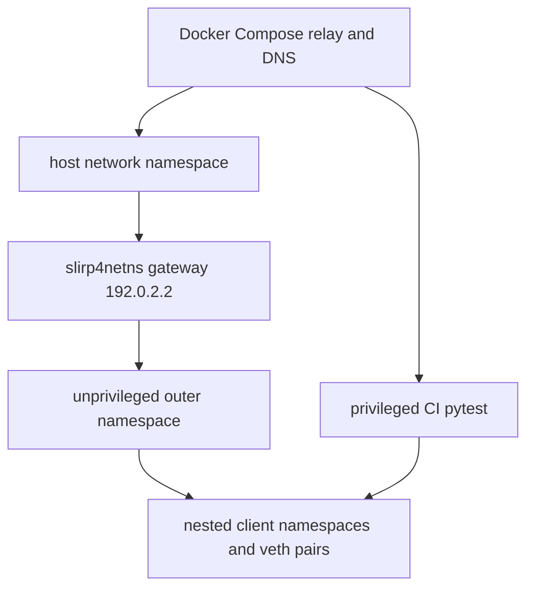

# feat: Hybrid Compose and user-namespace system tests

## Summary

Run pinned Iroh relay and DNS services through Docker Compose in every system-test
environment. Preserve the branch's unprivileged local namespace runner, but bridge
its isolated outer network namespace to host Compose services with
`slirp4netns`. Provide a separate privileged CI entrypoint because GitHub-hosted
Linux does not reliably permit the user-namespace path.

## Problem Frame

System tests need real Linux network namespaces, veth pairs, forwarding, and
traffic shaping. The original Docker Compose flow worked in CI but required host
root. The first namespace migration removed Docker and downloaded Iroh binaries,
which made local execution independent of containers but added a complex custom
cache, verification, and process lifecycle and left CI unsupported.

The hybrid keeps the useful namespace isolation and topology hardening while
returning service deployment to one pinned Compose definition.

## Requirements

- R1. Docker Compose is the only relay/DNS deployment path. Images remain pinned
  to `n0computer/iroh-relay:v1.0.2` and `n0computer/iroh-dns-server:v1.0.2`.
- R2. No downloaded Iroh binaries, binary lockfile, direct service subprocesses,
  or custom binary cache remain.
- R3. Local agents use `system-tests/run-in-user-namespace.sh` without `sudo`.
  The runner creates `unshare --user --map-root-user --net --mount`, attaches
  `slirp4netns`, and reaches host services through `192.0.2.2`.
- R4. CI uses `system-tests/run-privileged.sh`; pytest runs on the host
  with the existing nested client topology.
- R5. Both paths generate per-run relay certificates outside the checkout, use a
  fixed-port lock, capture Compose logs, and tear Compose down on every outcome.
- R6. Nested client namespaces, veth pairs, forwarding rules, reachability ping,
  `tc netem`, xdist behavior, seeded ordering, and artifacts remain unchanged.
- R7. Local unsupported hosts fail with actionable diagnostics and may use the
  privileged entrypoint only where root is authorized.

## Technical Design

Local mode configures `tp-slirp0` with CIDR `192.0.2.0/24`. The namespace runner
validates the interface and host route, then masquerades nested `10.0.0.0/8`
traffic through it. `TopologyManager` uses `192.0.2.2` for relay, DNS, and PKARR
when `TELEPATHY_DISCOVERY_HOST` is set.

Privileged mode leaves `TELEPATHY_DISCOVERY_HOST` unset. Existing semantics remain:
relay identity `100.64.0.1:3340`, DNS and PKARR through each veth gateway. The
wrapper enables forwarding only for the run, removes the loopback alias, restores
sysctl state, captures logs, and chowns artifacts to the sudo caller.

## Implementation Units

### U1. Compose lifecycle

Restore one pinned Compose file and shared `up.sh`, `down.sh`, and
`capture-discovery-logs.sh`. `up.sh` accepts a per-run state directory, generates
certificates there, and mounts it read-only. Fixed host ports are serialized by a
caller-held `flock` lease.

### U2. Local namespace bridge

`run-in-user-namespace.sh` starts Compose, creates a blocked outer namespace, waits
for the child to report that UID mapping completed, starts
`slirp4netns --configure` against that PID, waits for the ready FD, then
releases the namespace runner. The runner verifies Slirp state, installs the
scoped MASQUERADE rule, probes Compose readiness, and owns pytest cleanup.

### U3. Privileged CI path

`run-privileged.sh` starts as the calling user, starts Compose without sudo, then
uses non-interactive sudo only for host forwarding, the supplied pytest command,
loopback-alias cleanup, and artifact ownership repair. The workflow invokes it with
the setup-Python executable.

### U4. Harness and contracts

`harness/discovery.py` retains only bounded HTTP and DNS readiness probes.
`TopologyManager` supports the Slirp discovery-host override without changing
privileged endpoint behavior. Contract tests cover workflow shape, Compose files,
Slirp command synchronization, cleanup, endpoint selection, and removal of binary
download code.

## Verification

Completed on the implementation branch:

1. Focused harness and contract tests: `200 passed` before full runtime validation.
2. Real local unprivileged smoke: `4 passed in 3.69s`.
3. Real local unprivileged full suite: `624 passed, 8 skipped in 210.07s`.
4. The eight skips are privileged-wrapper fake tests that do not apply as mapped
   root inside the local user namespace.
5. Shell syntax, Compose configuration, certificate generation, and
   `git diff --check` passed; Compose teardown left no system-test containers.

CI must still validate the privileged entrypoint on GitHub Actions.

## Risks

- Docker socket access remains host-root-equivalent even in the no-sudo local
  path.
- Slirp is user-space NAT; full-suite UDP/QUIC performance must be validated.
- Fixed host ports prohibit concurrent system-test stacks, so the lock is part of
  the public contract.
- Privileged pytest mutates host namespace state; use only ephemeral CI runners or
  authorized development hosts.
