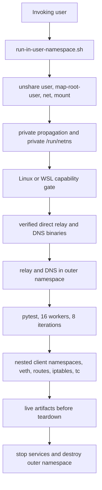

# feat: Run system tests in unprivileged user namespaces

## Summary

Move all privileged-looking network setup into a user-owned outer namespace created by `unshare --user --map-root-user --net --mount`. The invoking user becomes root only inside that namespace, so system tests keep real nested client namespaces, veth pairs, routes, iptables rules, and `tc netem` without changing host network state or requiring host privilege.

Replace Docker Compose discovery services with pinned direct relay and DNS executables started inside outer namespace. Runner installs or restores verified binaries from user cache before run. Missing cache, failed download verification, or unsupported host fails fast. No privilege fallback exists.

## Problem Frame

Current system tests create network namespaces and host forwarding rules directly, then CI uses `sudo -E` to run pytest. Discovery runs through `system-tests/docker-compose.yml` with host networking. This gives mutable checkout code host network authority and couples tests to Docker, Compose, privileged containers, and host iptables behavior.

System tests need real Linux networking. They must retain 16 xdist workers, eight iterations, deterministic seed ordering, sweep behavior, real CLI processes, real discovery services, and failure artifacts. Security boundary must move below test process, not remove network fidelity.

## Requirements

- R1. System-test entrypoint runs outer namespace as invoking user through `unshare --user --map-root-user --net --mount`, never through `sudo` or another host privilege grant.
- R2. Outer namespace makes mount propagation private and mounts a private `/run/netns` before nested namespaces are created.
- R3. Nested client namespaces retain current veth pairs, addresses, routes, iptables forwarding rules, and `tc netem` profiles. None reach host namespaces, interfaces, routes, iptables, or qdiscs.
- R4. Discovery uses pinned direct `iroh-relay` and `iroh-dns-server` executables in outer namespace. Binary install, version check, checksum verification, and user cache lookup complete before services start.
- R5. Unsupported native Linux and WSL environments fail at preflight with remediation. No fallback to sudo, Docker, Compose, containers, host networking, host iptables, host namespaces, root broker, VM, Docker socket, or Docker group access.
- R6. Runner proves relay and DNS readiness from outer namespace before pytest. Test services and client processes stay inside namespace tree.
- R7. Existing pytest behavior remains: 16 workers from `system-tests/pytest.ini`, eight default iterations from `system-tests/conftest.py`, order-seed propagation, three CI sweeps for pull requests, and ten scheduled or manual sweeps.
- R8. Failure artifacts remain real and capture test output, runner logs, discovery logs, namespace topology, routes, forwarding rules, qdiscs, order seed, iteration, worker, and cleanup result before teardown removes state.
- R9. CI runs unprivileged namespace runner on supported Linux runner, uploads artifacts on every outcome, and never starts Compose or executes pytest with sudo.
- R10. Contributor documentation names support gate, invocation, binary cache, artifacts, and unsupported environments.

## Scope Boundaries

- Supported hosts are native Linux and WSL only when preflight proves unprivileged user namespaces, user namespace networking, private mounts, required commands, and nested namespace operations work.
- WSL support is empirical. Preflight result, not distro name or Docker availability, decides support.
- Direct discovery binaries are required prerequisites. Runner may populate user-owned verified cache, but cannot substitute container images or an unpinned system executable.
- Existing `system-tests/relay/config.toml`, `system-tests/dns/config.dev.toml`, TLS certificate generation, scenarios, CLI build, topology, and artifacts remain part of test system.
- Delete Compose lifecycle from test path. `system-tests/docker-compose.yml`, `system-tests/up.sh`, and `system-tests/down.sh` are removed once runner supersedes them.

### Deferred to Follow-Up Work

- Non-Linux system-test execution.
- Remote binary mirror or shared artifact retention.
- Discovery service upgrades unrelated to this architecture.

## Settled Technical Decisions

| ID | Decision | Choice and rationale |
|---|---|---|
| KTD1 | Privilege boundary | User owns outer `unshare --user --map-root-user --net --mount` process. Root identity exists only inside user namespace. No sudo wrapper, passwordless sudo, root broker, VM, privileged container, or host capability grant. |
| KTD2 | Mount and namespace isolation | Runner remounts propagation private and creates private `/run/netns` in outer mount namespace before `ip netns add`. Nested names persist only under that mount tree. |
| KTD3 | Discovery services | Replace Compose with pinned direct relay and DNS binaries. Start them as outer-namespace processes and discover fixed namespace-local endpoints through explicit runner configuration. |
| KTD4 | Binary trust and cache | Install discovery binaries into user-owned cache only after pinned version and checksum verification. Cache hit must revalidate version and digest. Missing prerequisites fail before topology creation. |
| KTD5 | Unsupported environments | Preflight fails fast. It must never offer Docker, Compose, Docker socket or group access, host networking, host iptables, host namespaces, sudo, rootful or privileged containers, root broker, or VM as fallback. |
| KTD6 | Fidelity | Preserve nested client namespace topology and all existing test pressure. Move its parent network scope, not its behavior. |
| KTD7 | Evidence | Capture live namespace and direct-service state before fixture and runner teardown. Artifacts reflect real process and kernel state, not mocked summaries. |

## High-Level Technical Design

Outer namespace contains all test state. When runner exits, kernel destroys outer network and mount namespaces, including direct discovery processes and nested client namespaces. Runner still performs ordered teardown and records outcome so failed cleanup is visible.

## Implementation Units

### U1. Create User Namespace Runner and Capability Preflight

**Goal:** Establish single user-owned entrypoint and reject hosts that cannot provide required isolated networking.

**Requirements:** R1, R2, R3, R5, R9

**Dependencies:** None

**Files:**
- Create: `system-tests/run-in-user-namespace.sh`
- Create: `system-tests/harness/namespace_runner.py`
- Create/Test: `system-tests/tests/test_namespace_runner.py`
- Modify: `system-tests/harness/topology.py`
- Modify: `system-tests/harness/process.py`

**Approach:**
1. Make shell runner validate user-facing prerequisites, then exec exact `unshare --user --map-root-user --net --mount` command into Python runner.
2. In outer namespace, make mounts private, mount private `/run/netns`, confirm effective namespace ownership, then run disposable nested namespace, veth, route, iptables, and `tc netem` checks.
3. Refactor topology assumptions only where needed to bind nested namespace storage and forwarding state to outer namespace. Preserve existing client naming, addresses, routes, forwarding, and traffic profiles.
4. Detect native Linux versus WSL, record relevant capability failure, and exit before discovery setup or pytest when gate fails.

**Patterns to follow:** `system-tests/harness/topology.py` for topology lifecycle; `system-tests/harness/process.py` for `ip netns exec`; `system-tests/tests/test_topology.py` for topology assertions.

**Test scenarios:**
- Happy path: runner command enters mapped user, network, and mount namespaces, private mount propagation holds, and private `/run/netns` exists before nested namespace creation.
- Validation: missing `unshare`, user namespace disabled, denied network namespace, failed private mount, or unavailable `ip`, `iptables`, or `tc` exits before service or pytest startup.
- Integration: temporary nested namespace creates veth, route, forwarding rules, and qdisc, then cleanup removes all state from outer namespace.
- WSL gate: detected WSL with unsupported namespace or mount behavior reports unsupported environment and exact failed prerequisite.
- Regression: topology and process command construction still uses nested `ip netns exec` and never accepts host-root execution path.

**Verification:** Supported host smoke test demonstrates host namespace and host `/run/netns` remain unchanged before and after normal and interrupted runner invocations.

### U2. Install and Run Direct Discovery Binaries

**Goal:** Replace Compose services with verified user-owned direct relay and DNS processes in outer namespace.

**Requirements:** R4, R5, R6

**Dependencies:** U1

**Files:**
- Create: `system-tests/discovery-binaries.lock`
- Create: `system-tests/harness/discovery.py`
- Create/Test: `system-tests/tests/test_discovery.py`
- Modify: `system-tests/relay/gen-certs.sh`
- Modify: `system-tests/relay/config.toml`
- Modify: `system-tests/dns/config.dev.toml`
- Delete: `system-tests/docker-compose.yml`
- Delete: `system-tests/up.sh`
- Delete: `system-tests/down.sh`

**Approach:**
1. Record exact relay and DNS release versions, archive URLs, executable names, and SHA-256 digests in lock file.
2. Resolve cache location under invoking user's home, install missing binaries atomically, verify archive and executable identity, and reject mismatched cache contents.
3. Generate certificates before relay starts. Start relay and DNS as managed outer-namespace child processes with per-run logs and explicit endpoint configuration.
4. Probe relay, DNS, and pkarr endpoints before pytest. Pass verified direct endpoints to current topology discovery methods without Docker name lookup or host networking.
5. Remove Compose files and scripts rather than leave alternate discovery path.

**Patterns to follow:** `system-tests/relay/gen-certs.sh`; discovery endpoint methods in `system-tests/harness/topology.py`; failure output capture in `system-tests/tests/test_scenarios.py`.

**Test scenarios:**
- Happy path: empty cache downloads pinned archives, verifies checksums, installs executable pair, starts services, and readiness probes pass.
- Cache path: valid cached binaries with locked versions and digests run without download.
- Validation: stale version, checksum mismatch, missing archive tool, missing executable, or failed TLS certificate generation stops before pytest or topology setup.
- Failure path: relay or DNS process exit, timeout, or failed application probe records service logs and returns nonzero.
- Regression: discovery configuration supplies relay, DNS, origin-domain, and pkarr endpoints without Docker, Compose, container names, socket, group, or host network access.

**Verification:** Clean user cache and populated user cache both complete direct readiness probe inside outer namespace. Host sees no Docker containers, networks, or sockets touched.

### U3. Preserve Live Artifacts Across Namespace Teardown

**Goal:** Retain real failure evidence while outer and nested namespaces still exist.

**Requirements:** R7, R8

**Dependencies:** U1, U2

**Files:**
- Modify: `system-tests/conftest.py`
- Modify: `system-tests/harness/topology.py`
- Modify: `system-tests/harness/process.py`
- Modify: `system-tests/tests/test_scenarios.py`
- Create/Test: `system-tests/tests/test_namespace_artifacts.py`
- Modify: `system-tests/harness/namespace_runner.py`

**Approach:**
1. Add run context containing run ID, order seed, cache status, service endpoints, artifact root, and namespace identity.
2. Snapshot nested namespaces, links, addresses, routes, forwarding rules, qdiscs, direct-service status, and selected process logs before fixture teardown.
3. Preserve current `debug.json`, CLI stdout, CLI stderr, iteration, worker, and JUnit behavior. Add run manifest and cleanup report without full environment or secret dumps.
4. Keep artifact creation user-owned and private. Runner records partial capture failures while continuing remaining capture and teardown.

**Patterns to follow:** `record_test_artifacts` and `_build_debug_artifact_payload` in `system-tests/conftest.py`; CLI log retention in `system-tests/harness/process.py`.

**Test scenarios:**
- Happy path: failed scenario writes per-test debug output, runner log, direct-service log, manifest, JUnit, topology snapshot, and cleanup report.
- Integration: forced test failure captures namespace routes, forwarding rules, and qdisc before fixture destroys nested namespace.
- Error path: setup failure, discovery readiness failure, pytest failure, teardown failure, and SIGTERM each retain manifest and cleanup result.
- Privacy: artifact data contains allowlisted metadata and excludes private certificate keys, tokens, and full environment dumps.
- Edge case: one capture command fails while other captures and namespace teardown continue.

**Verification:** Intentional test failure produces inspectable real namespace and service evidence, then confirms outer namespace exit leaves no surviving nested namespace.

### U4. Migrate CI Without Privileged or Container Paths

**Goal:** Call user namespace runner from CI while keeping system-test pressure and sweep behavior unchanged.

**Requirements:** R5, R7, R9

**Dependencies:** U1, U2, U3

**Files:**
- Modify: `.github/workflows/system-tests.yml`
- Modify: `.github/workflows/ci.yml`
- Modify: `.github/workflows/system-tests-nightly.yml`
- Modify: `system-tests/conftest.py`
- Modify/Test: `system-tests/tests/test_ordering.py`
- Modify/Test: `system-tests/tests/test_topology.py`
- Create/Test: `system-tests/tests/test_system_test_ci_contract.py`

**Approach:**
1. Replace workflow-level Compose, certificate generation, and sudo pytest steps with one namespace runner invocation after ordinary build and Python setup.
2. Select Linux runner label that meets U1 preflight. Preflight failure marks system-test environment unsupported instead of granting privilege or changing infrastructure.
3. Preserve matrix sweep input and seeds formed from GitHub run ID plus sweep index. Preserve 40-minute timeout, `fail-fast: false`, `pytest.ini` 16-worker setting, and `conftest.py` eight-iteration default.
4. Upload runner artifact root on success, test failure, or preflight failure.

**Patterns to follow:** reusable workflow input in `.github/workflows/system-tests.yml`; current seed propagation in `system-tests/conftest.py`; worker setting in `system-tests/pytest.ini`.

**Test scenarios:**
- Regression: CI contract contains no `sudo`, `docker`, `docker compose`, host networking, container privilege, Docker socket, or Docker group setup.
- Happy path: workflow invokes only `system-tests/run-in-user-namespace.sh` and uploads its artifact root.
- Coverage: pull request caller retains three sweeps, nightly and manual caller retain ten sweeps, and each seed remains GitHub run ID plus sweep index.
- Reproducibility: runner manifest and JUnit contain supplied order seed, worker, and iteration values.
- Failure path: unsupported preflight and nonzero pytest both upload artifacts and do not mask original exit status.

**Verification:** Workflow syntax and contract tests pass. CI-equivalent supported-host run proves 16 workers, eight iterations, three or ten sweeps, and failure artifact upload.

### U5. Document Support Gate and Migration

**Goal:** Replace privileged Docker instructions with clear unprivileged namespace operating contract.

**Requirements:** R5, R9, R10

**Dependencies:** U1, U2, U3, U4

**Files:**
- Modify: `AGENTS.md`
- Modify: `CONTRIBUTING.md`
- Create: `docs/system-tests-user-namespaces.md`
- Modify: `system-tests/requirements.txt`
- Modify: `system-tests/build.sh`

**Approach:**
1. Document supported native Linux and WSL preflight gate, exact unprivileged invocation, direct binary cache ownership, binary verification, service logs, artifact location, and safe recovery.
2. Name prohibited fallback paths explicitly: sudo, passwordless sudo wrapper, Docker, Compose, rootful or privileged container, Docker socket or group, host networking, host iptables, host namespace, root broker, and VM.
3. Explain that unsupported preflight is terminal for that environment. Contributors must repair prerequisite or use supported host, never bypass isolation.
4. Update repository guidance from Docker-backed test description to user-namespace architecture.

**Test scenarios:**
- Documentation: guidance names exact namespace command shape, private `/run/netns`, direct pinned binaries, cache prerequisite, and artifact retrieval.
- Documentation: prohibited fallback list matches KTD5 and contains no old passwordless sudo wrapper recommendation.
- Rollout: native Linux and WSL certification records preflight pass, normal run, forced failure, interrupt cleanup, and repeated run before CI enables target.
- Rollout: unsupported WSL capability result stays documented as unsupported until full preflight and smoke evidence pass.

**Verification:** New contributor can decide host support, prepare cache, run suite, and retrieve artifacts without Docker or host privilege instructions.

## Verification Contract

1. Run focused Python tests for `namespace_runner`, `discovery`, namespace artifacts, topology, ordering, and CI contract.
2. Run full system-test unit suite without sudo, Docker, Compose, container runtime, or host network mutation.
3. On native Linux, run preflight, normal suite, forced test failure, SIGTERM interruption, and repeated suite. Check host namespaces, `/run/netns`, interfaces, routes, iptables, and qdiscs before and after each run.
4. Repeat supported-host smoke sequence under WSL. Treat any failed user namespace, private mount, nested namespace, direct discovery, or cleanup step as unsupported.
5. Run CI-equivalent three-sweep and ten-sweep paths. Confirm 16 workers, eight iterations, seed propagation, real artifacts, and artifact upload after failures.
6. Inspect workflow and runner command plans to prove prohibited fallback paths are absent.

## Rollout and Risks

| Risk | Mitigation |
|---|---|
| Host kernel disables user namespaces | Preflight stops before cache install, service start, topology, or pytest. Document host configuration requirement. |
| WSL differs from native Linux | Certify through capability and smoke tests, not platform label. Leave failed variants unsupported. |
| Direct binary supply chain drift | Lock version, URL, and checksum. Verify cache and fresh downloads before use. |
| Nested namespace teardown leaks state | Private outer namespace contains state. Explicit teardown plus host before-and-after checks catches runner defects. |
| Discovery readiness is false positive | Use application probes against direct relay, DNS, and pkarr endpoints before pytest. |
| CI coverage changes during migration | Contract tests lock 16 workers, eight iterations, seed format, timeout, fail-fast setting, and three or ten sweep callers. |
| Artifact capture misses transient state | Capture before fixture and outer namespace teardown, record capture failures separately. |

## Definition of Done

- `system-tests/run-in-user-namespace.sh` runs all privileged network operations inside user-owned `unshare --user --map-root-user --net --mount` scope with private propagation and private `/run/netns`.
- No test path uses sudo, passwordless sudo wrapper, Docker, Compose, rootful or privileged containers, Docker socket or group access, host networking, host iptables, host namespaces, root broker, or VM infrastructure.
- Direct relay and DNS executables are version-pinned, checksum-verified, cached under invoking user, and fail fast when unavailable or invalid.
- Current nested client namespaces, veth, routes, iptables, `tc netem`, real CLI processes, 16 workers, eight iterations, seed propagation, and sweep policy remain intact.
- Native Linux and WSL support require passed preflight and smoke evidence. Unsupported environments stop without privilege fallback.
- Failure, interruption, and cleanup produce real artifacts before state disappears.
- CI invokes namespace runner, preserves three and ten sweep behavior, and uploads artifacts for every outcome.
